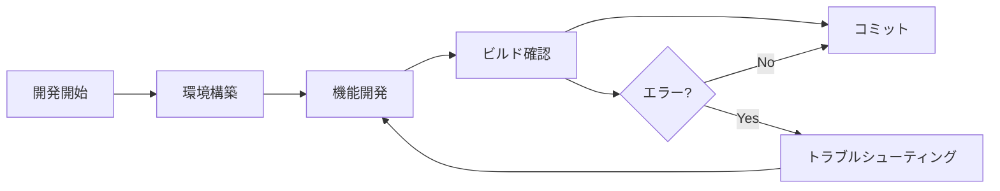

# プロジェクトドキュメント

バナーズ野球クラブホームページプロジェクトのドキュメントです。

## 📁 ドキュメント構成

### 🏗️ [architecture/](./architecture/) - アーキテクチャ
- [**overview.md**](./architecture/overview.md) - プロジェクト概要と技術スタック
- [**directory-structure.md**](./architecture/directory-structure.md) - ディレクトリ構成の詳細
- [**dependencies.md**](./architecture/dependencies.md) - 依存関係管理
- [**database.md**](./architecture/database.md) - D1データベース設計

### 🛠️ [development/](./development/) - 開発環境
- [**getting-started.md**](./development/getting-started.md) - 開発環境セットアップ
- [**workflow.md**](./development/workflow.md) - 開発ワークフロー
- [**commands.md**](./development/commands.md) - 利用可能なコマンド一覧
- [**troubleshooting.md**](./development/troubleshooting.md) - よくある問題と解決方法

### 🔧 [build/](./build/) - ビルドシステム
- [**build-system.md**](./build/build-system.md) - Turborepo + pnpm ビルドシステム
- [**dependencies.md**](./build/dependencies.md) - パッケージ間ビルド依存関係
- [**verification.md**](./build/verification.md) - ビルド確認手順（必読）

### 🚀 [deployment/](./deployment/) - デプロイメント
- [**frontend.md**](./deployment/frontend.md) - フロントエンドデプロイ手順
- [**backend.md**](./deployment/backend.md) - Cloudflare Workers デプロイ

## 🚀 クイックスタート

### すぐに開発を始めたい場合
1. [開発環境構築](./development/getting-started.md)
2. [コマンドリファレンス](./development/commands.md)

### プロジェクトを理解したい場合
1. [プロジェクト概要](./architecture/overview.md)
2. [ディレクトリ構成](./architecture/directory-structure.md)

### ビルドエラーが発生した場合
1. [ビルド確認手順](./build/verification.md) ← **必須確認**
2. [トラブルシューティング](./development/troubleshooting.md)

## 🔄 開発フロー

## 📋 完了条件チェックリスト

全ての開発完了時に確認：

- [ ] [ビルド確認手順](./build/verification.md) に従って実行
- [ ] `pnpm run typecheck` 成功
- [ ] `pnpm run lint` 成功  
- [ ] `pnpm run build` 成功
- [ ] client と inhouse の個別ビルド成功

## 🆘 困ったときは

1. **ビルドエラー** → [ビルド確認手順](./build/verification.md)
2. **環境設定の問題** → [トラブルシューティング](./development/troubleshooting.md)
3. **コマンドがわからない** → [コマンドリファレンス](./development/commands.md)
4. **デプロイ手順** → [フロントエンド](./deployment/frontend.md) / [バックエンド](./deployment/backend.md)

## 📚 関連リンク

- [メインドキュメント (CLAUDE.md)](../CLAUDE.md) - 統合ドキュメント
- [プロジェクトルート](../) - プロジェクトトップ