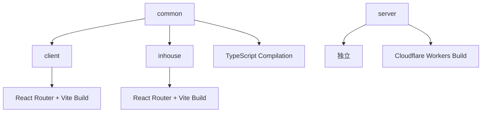

# ビルド依存関係

## パッケージ間ビルド依存関係



## ビルド順序

### 1. common (最優先)
```bash
cd common
pnpm run build  # tsc コンパイル
```

**成果物**: `build/` ディレクトリに JS + 型定義ファイル

### 2. client, inhouse (並列可能)
```bash
# 並列実行可能 (common完了後)
cd client && pnpm run build &
cd inhouse && pnpm run build &
wait
```

**成果物**: `.react-router/` に最適化されたWebアプリ

### 3. server (独立)
```bash
cd server
pnpm run server-deploy  # Cloudflare Workers
```

**成果物**: Cloudflare Workers環境にデプロイ

## TypeScript依存関係

### common → client/inhouse
```typescript
// client/app での参照
import { Button } from "@project/common/ui/button";
import { cn } from "@project/common/lib/utils";
```

### 参照方式の違い

#### 開発時 (推奨)
- TypeScriptソースファイル直接参照
- 高速なホットリロード
- 型チェックのリアルタイム反映

```json
// client/package.json - devDependencies
"@project/common": "workspace:*"
```

#### 本番時
- ビルド成果物参照
- 最適化されたJavaScript

```json
// common/package.json - exports
{
  "exports": {
    "./ui/*": {
      "types": "./build/ui/*.d.ts",
      "default": "./build/ui/*.js"
    }
  }
}
```

## Turbo依存関係設定

### turbo.json設定
```json
{
  "tasks": {
    "build": {
      "dependsOn": ["^build"],  // 依存パッケージを先にビルド
      "outputs": [
        "dist/**",
        "build/**", 
        ".react-router/**"
      ]
    },
    "typecheck": {
      "dependsOn": ["^build"]   // 型チェックも依存関係を尊重
    }
  }
}
```

### 実行時の依存解決
```bash
pnpm turbo build
# 1. common をビルド
# 2. client, inhouse を並列ビルド
# 3. server は独立して実行
```

## 外部依存関係

### 共通依存関係
- **React**: v19.1.0
- **TypeScript**: 最新
- **TailwindCSS**: v4.1.4
- **Radix UI**: 各コンポーネント最新

### ビルドツール依存関係
- **Vite**: React Router v7 統合
- **tsc**: TypeScriptコンパイラ
- **Wrangler**: Cloudflare Workers CLI

## 依存関係の確認方法

### パッケージ依存関係表示
```bash
# 全体の依存関係
pnpm list --depth=1

# 特定パッケージの依存関係
cd client && pnpm list
```

### ビルド依存関係確認
```bash
# Turbo依存関係グラフ
pnpm turbo build --graph

# 依存関係の詳細分析
pnpm turbo build --verbose
```

## 依存関係のトラブルシューティング

### 1. 循環依存の検出
```bash
pnpm turbo build --graph | grep -i cycle
```

### 2. 依存関係の不整合
```bash
# 依存関係の再同期
pnpm install --frozen-lockfile=false

# workspace依存関係の確認
pnpm list --depth=0 --workspace-root
```

### 3. ビルド順序の問題
```bash
# 強制的に順序実行
pnpm turbo build --concurrency=1
```

## 最適化のポイント

### 1. キャッシュ効率化
- **granular tasks**: タスクの細分化
- **selective invalidation**: 変更されたファイルのみ再ビルド

### 2. 並列実行最大化
- **independent tasks**: 独立タスクの並列化
- **dependency optimization**: 不要な依存関係の除去

### 3. インクリメンタルビルド
- **TypeScript project references**: プロジェクト参照の活用
- **Vite dependency pre-bundling**: 依存関係の事前バンドル

## 関連ドキュメント

- [ビルドシステム](./build-system.md)
- [ビルド確認手順](./verification.md)
- [トラブルシューティング](../development/troubleshooting.md)